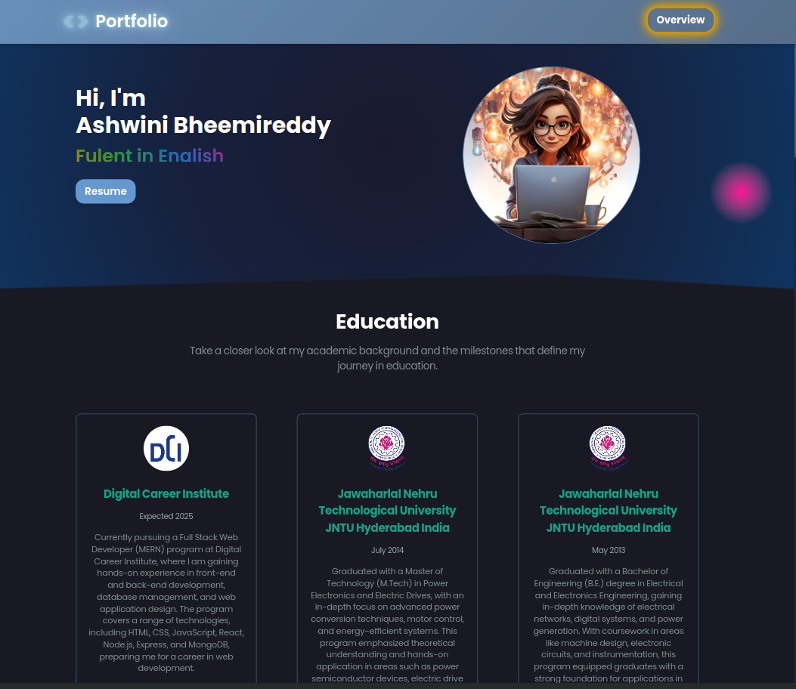

# 🌟 Personal Portfolio

Welcome to my **Personal Portfolio**! This website showcases my education, professional experience, projects, and serves as a gateway to connect with potential collaborators and employers.

## 📚 Table of Contents

- [🌟 Personal Portfolio](#-personal-portfolio)
  - [📚 Table of Contents](#-table-of-contents)
  - [✨ Features](#-features)
  - [🛠 Tech Stack](#-tech-stack)
  - [📂 Project Structure](#-project-structure)
  - [🚀 Getting Started](#-getting-started)
    - [Prerequisites](#prerequisites)
    - [Installation](#installation)
    - [Build for Production](#build-for-production)
    - [Preview the Build](#preview-the-build)
  - [📸 Screenshots](#-screenshots)
  - [🎓 Education](#-education)
    - [Full Stack Web Developer (MERN)](#full-stack-web-developer-mern)
    - [Master of Technology (M.Tech) in Power Electronics and Electric Drives](#master-of-technology-mtech-in-power-electronics-and-electric-drives)
    - [Bachelor of Engineering (B.E.) - Electrical and Electronics Engineering](#bachelor-of-engineering-be---electrical-and-electronics-engineering)
  - [💼 Experience](#-experience)
    - [Application Development for Mobile Applications](#application-development-for-mobile-applications)
  - [🌐 Deployment](#-deployment)
  - [🤝 Contributing](#-contributing)
    - [Steps to Contribute](#steps-to-contribute)
  - [🙏 Acknowledgments](#-acknowledgments)

---

## ✨ Features

- **Modern Design:** using Styled Components for maintainable, dynamic styling.
- **Responsive Layout:** Optimized for all screen sizes, from desktops to smartphones.
- **Dynamic Styling:** Powered by Styled Components for maintainable and modular CSS-in-JS.
- **Fast Performance:** Built using Vite, offering quick builds and efficient bundling.
- **Interactive Components:** Includes animations and transitions for a polished user experience.
- **Contact Form:** Enables visitors to connect directly.

---

## 🛠 Tech Stack

- **Frontend Framework:** React
- **Build Tool:** Vite
- **Styling:** Styled Components
- **Hosting:** Render.com

---

## 📂 Project Structure

```plaintext
├── src
│   ├── assets        
│   ├── components      
│   ├── Utils         
│   ├── styles 
|   ├── data
│   ├── App.jsx         
│   └── main.jsx 
|       
├── public            
├── .gitignore         
├── package.json       
├── vite.config.js     
└── README.md         
```

---

## 🚀 Getting Started

Follow these steps to set up and run the project locally.

### Prerequisites

- **Node.js** (v16 or higher)
- **npm** or **yarn** package manager

### Installation

1. **Clone the repository:**

   ```bash
   git clone https://github.com/bheemireddyashwini/My-Portfolio
   cd portfolio
   ```

2. **Install dependencies:**

   ```bash
   npm install
   # or
   yarn install
   ```

3. **Start the development server:**

   ```bash
   npm run dev
   # or
   yarn dev
   ```

4. **Open in Browser:**  
   Navigate to `http://localhost:5173` to view your portfolio.

### Build for Production

Generate an optimized production build:

```bash
npm run build
# or
yarn build
```

The build files will be in the `dist` directory.

### Preview the Build

To preview the production build locally:

```bash
npm run preview
# or
yarn preview
```

---

## 📸 Screenshots

| Home Page                                  | 
| ------------------------------------------ | 
| 

---

## 🎓 Education

### Full Stack Web Developer (MERN)

Currently pursuing a program at Digital Career Institute, where I am gaining hands-on experience in front-end and back-end development, database management, and web application design. The program covers a range of technologies, including:

- **HTML, CSS, JavaScript, React, Node.js, Express, and MongoDB**
- Preparing me for a career in web development.

### Master of Technology (M.Tech) in Power Electronics and Electric Drives

Graduated with an in-depth focus on advanced power conversion techniques, motor control, and energy-efficient systems. This program emphasized theoretical understanding and hands-on application in areas such as:

- Power semiconductor devices
- Electric drive systems
- Renewable energy integration

### Bachelor of Engineering (B.E.) - Electrical and Electronics Engineering

Gained comprehensive knowledge of electrical networks, digital systems, and power generation. With coursework in:

- Machine design
- Electronic circuits
- Instrumentation


---

## 💼 Experience

### Application Development for Mobile Applications

- Developed mobile applications using **Flutter**, Google’s cross-platform solution.
- Ensured seamless navigation and adaptability across various screen sizes on mobile devices.
- Designed, created, and installed a sample application for smart home control.
- Tested applications in simulators and on physical devices to ensure robustness and functionality.


---

## 🌐 Deployment

This portfolio is deployed on **Render.com**.  
Visit the live site [here]!(https://my-portfolio-vj75.onrender.com/)

---

## 🤝 Contributing

Contributions are welcome!

If you have suggestions for improvements or spot any issues, feel free to fork the repository and submit a pull request. Alternatively, open an issue to start a discussion.

### Steps to Contribute

1. Fork the repository.
2. Create a new branch:
   ```bash
   git checkout -b feature-name
   ```
3. Commit your changes:
   ```bash
   git commit -m "Add feature name"
   ```
4. Push to your branch:
   ```bash
   git push origin feature-name
   ```
5. Open a pull request.


---

## 🙏 Acknowledgments

- **[React](https://reactjs.org/):** For providing a robust frontend framework.
- **[Vite](https://vitejs.dev/):** For making development lightning-fast.
- **[Styled Components](https://styled-components.com/):** For elegant styling solutions.
- **[Unsplash](https://unsplash.com/):** For placeholder images used in the project.

---
